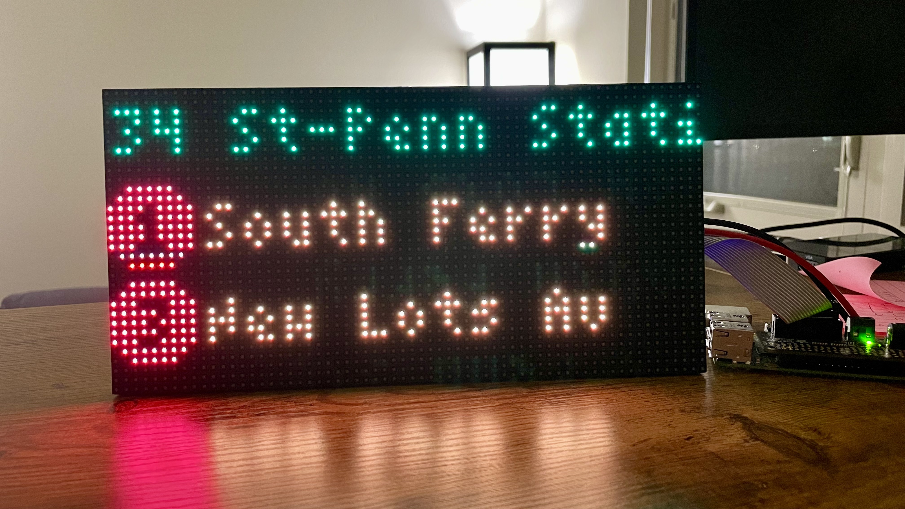
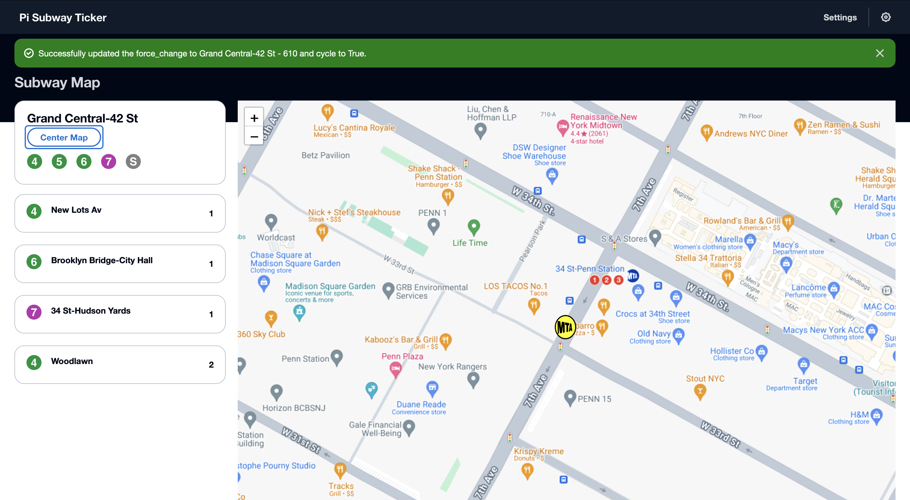
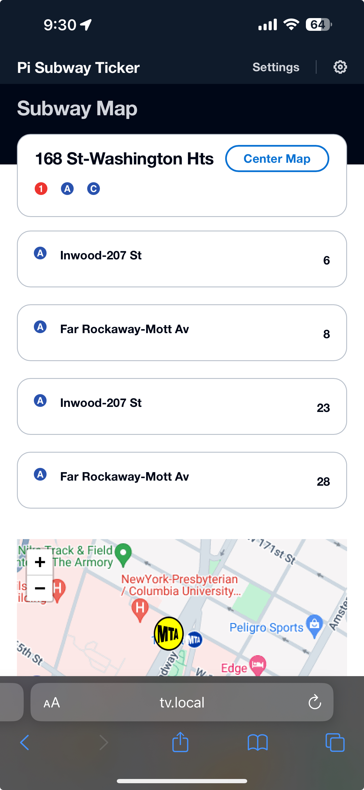

# Pi Subway Ticker

Pi Subway Ticker connects to the NYC API and displays live arrival data using a Raspberry Pi and a LED matrix. You can also view the information on a locally hosted website. It is currently usable only for a 64x32 LED matrix using an adafruit hat. 

## To install all dependencies needed:

$ ./setup.sh

## To run the code input the following:

$ ./subway_start.sh

## Future Plans
* Create a website that is hosted locally to change the station and see all MTA info (Completed!)
* More robust errors to better identify what when wrong
* Support for LIRR and Metro North